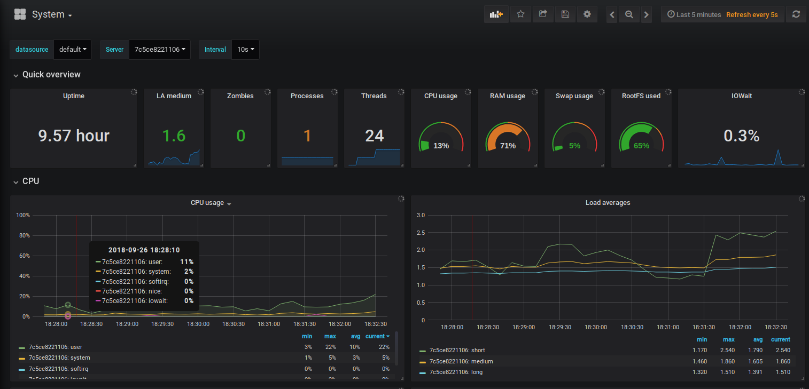

# yumd-dev
docker compose to create minimal development clustered infrastructure with monitoring tools




clustering components:
- etcd (subnet 10.20.10.0/24)
- redis (subnet 10.20.20.0/24)
- mysql (subnet 10.20.30.0/24)

monitoring components:
- grafana (10.20.40.10:3000)
- influxdb (10.20.40.11:8086)
- telegraf (10.20.40.12)

in order to setup infrastructure, in command line run the below command:
```
$ ./cmd.sh up
```

and for stop, execute the following command:
```
$ ./cmd.sh down
```

to clear all docker containers manually, run the following command:
```
$ ./cmd.sh clear
```

### etcd
creating 3 etcd instances:

```
yumd-etcd1: 10.20.10.10
yumd-etcd2: 10.20.10.11
yumd-etcd3: 10.20.10.12
```

### redis
create 6 redis instances in order to create a redis cluster

```
yumd-redis1: 10.20.20.10
yumd-redis2: 10.20.20.11
yumd-redis3: 10.20.20.12
yumd-redis4: 10.20.20.13
yumd-redis5: 10.20.20.14
yumd-redis6: 10.20.20.15
```

### mysql
create 2 mysql instances (```username:root``` and ```password:root```) by Galera cluster.

The management node:

```
yumd-mysql-mgm1: 10.20.30.10
```

The two data nodes:

```
yumd-mysql-ndb1: 10.20.30.50
yumd-mysql-ndb2: 10.20.30.51
```

The MySQL server node:

```
yumd-mysql-srv1:10.20.30.100
yumd-mysql-srv2: 10.20.30.101
```

### grafana
go to ```localhost:3000``` or ```10.20.40.10:3000``` and login with
```username:admin``` and ```password:admin```. this configuration automatically
provisioning data-sources and dashboards(for system, docker containers, mysql, redis).

### delete docker volumes
to delete dangling docker volumes run the following command:

```
docker volume rm $(docker volume ls -qf dangling=true)
```


